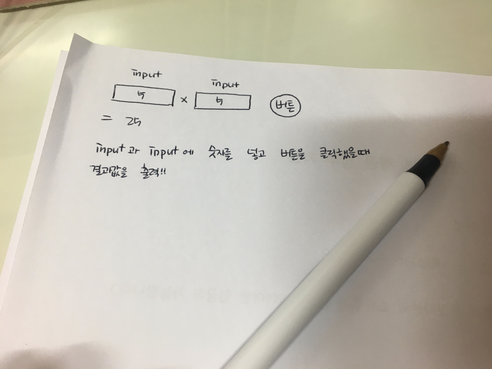

# Untitled

```javascript
console.log('Hello JS');
```

.은 ~의\(소유\)를 의미한다.  
\( \)는 동작 실행을 의미한다.  
★ 최대한 사람이 읽기쉽게 만들어야 한다!

## 화면에 표시

```javascript
document.write('hello Js');
```


어떻게 돌아갈지 그려보는 연습



순서도 그려보기 


화면을 구성하는 방법

1. 자바스크립트로 html 만들

    2. html로 만들고 자바스크립트로 가져오기

